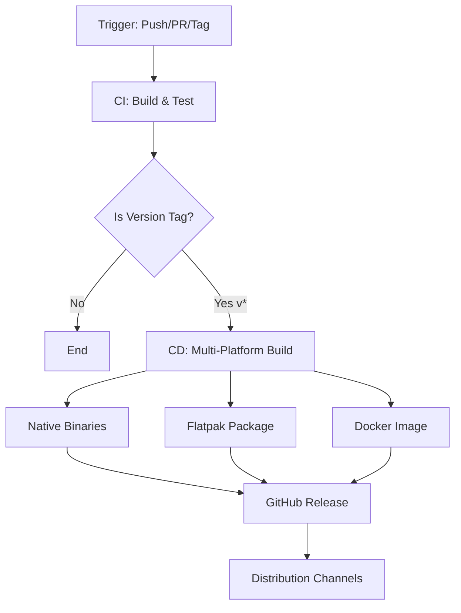

# CI/CD Pipeline Strategy

## Overview

The Crawler project implements a robust, automated CI/CD pipeline using GitHub Actions. The pipeline provides continuous integration for every code change, and continuous deployment for versioned releases. It supports multi-platform binary distribution (Windows, macOS, Linux), containerized deployment via Docker, and Linux package management through Flatpak.

## Pipeline Architecture



## Continuous Integration (CI)

**Workflow**: [`.github/workflows/ci.yml`](.github/workflows/ci.yml)

### Trigger Conditions

The CI pipeline executes on:
- **Pull Requests**: Every PR against any branch
- **Push to main**: Direct commits or merged PRs to the main branch
- **Version Tags**: Tags matching the pattern `v*` (e.g., `v1.0.0`, `v2.1.3`)

### Build Job

The CI job performs the following steps:

1. **Checkout**: Retrieves source code using `actions/checkout@v4`
2. **Setup .NET**: Configures .NET 10.x SDK with dependency caching enabled
3. **Restore**: Downloads NuGet packages (`dotnet restore Crawler.slnx`)
4. **Build**: Compiles the solution in Release configuration
5. **Test**: Executes all unit tests in the test suite

**Performance Optimization**: The pipeline leverages NuGet package caching based on `CrawlerCli.csproj` to reduce restore times on subsequent runs.

### Conditional CD Trigger

When a version tag is pushed (e.g., `git push origin v1.0.0`), the CI job automatically triggers the CD workflow upon successful completion:

```yaml
cd:
  if: startsWith(github.ref, 'refs/tags/v')
  needs: build
  uses: ./.github/workflows/cd.yml
```

This ensures that releases are only created after all tests pass.

## Continuous Deployment (CD)

**Workflow**: [`.github/workflows/cd.yml`](.github/workflows/cd.yml)

The CD pipeline is a reusable workflow invoked by the CI pipeline when version tags are detected. It orchestrates multi-platform builds, packaging, and distribution across multiple channels.

### Workflow Inputs & Secrets

**Required Inputs**:
- `release_tag`: The version tag (e.g., `v1.0.0`) passed from the CI workflow

**Required Secrets**:
- `DOCKERHUB_USERNAME`: Docker Hub account username
- `DOCKERHUB_TOKEN`: Docker Hub personal access token or password

**Permissions**:
- `contents: write` — Required for creating GitHub releases and uploading release assets

## Multi-Platform Native Publishing

**Job**: `publish-native`

### Build Matrix

The pipeline builds self-contained, single-file native executables for three platforms:

| Platform | Runtime ID | Runner | Output Format |
|----------|-----------|---------|---------------|
| Windows 64-bit | `win-x64` | `windows-latest` | `.exe` |
| macOS Intel | `osx-x64` | `macos-14` | `.tar.gz` |
| macOS Apple Silicon | `osx-arm64` | `macos-14` | `.tar.gz` |

### Build Configuration

Native binaries are published with the following settings:
- **Configuration**: Release
- **Self-Contained**: `true` (includes .NET runtime)
- **Single File**: `PublishSingleFile=true`
- **Trimming**: `PublishTrimmed=false` (preserves full runtime for compatibility)

### Packaging Strategy

**Windows**:
```bash
crawler-v1.0.0-win-x64.exe
```

**macOS**:
```bash
crawler-v1.0.0-osx-x64.tar.gz
crawler-v1.0.0-osx-arm64.tar.gz
```

Each platform-specific artifact is uploaded separately and later aggregated in the release job.

## Flatpak Publishing

**Job**: `publish-flatpak`

### Purpose

Flatpak provides a universal Linux packaging format that works across all major distributions (Ubuntu, Fedora, Arch, etc.). This ensures Linux users can install the crawler through their native package managers.

### Build Process

1. **Native Linux Build**: Compiles a `linux-x64` self-contained binary
2. **Flatpak Tooling Setup**: Installs Flatpak builder and Freedesktop SDK
   - Platform: `org.freedesktop.Platform//24.08`
   - SDK: `org.freedesktop.Sdk//24.08`
3. **Bundle Creation**: Builds Flatpak bundle from manifest at [`packaging/flatpak/io.github.bruno.crawler.json`](../packaging/flatpak/io.github.bruno.crawler.json)
4. **Artifact Output**: `crawler-v1.0.0-linux-x64.flatpak`

### Installation

End users can install the Flatpak bundle with:
```bash
flatpak install --user crawler-v1.0.0-linux-x64.flatpak
```

## Docker Publishing

**Job**: `publish-docker`

### Multi-Stage Docker Build

The Dockerfile implements a two-stage build strategy:

**Stage 1: Build**
- Base image: `mcr.microsoft.com/dotnet/sdk:10.0`
- Restores dependencies and compiles the application

**Stage 2: Runtime**
- Base image: `mcr.microsoft.com/dotnet/runtime:10.0`
- Contains only the compiled application and .NET runtime (smaller image size)

### Docker Hub Distribution

Images are pushed to Docker Hub repository: **`nusbru/crawler`**

### Tagging Strategy

Each release creates two tags:
1. **Version-specific**: `nusbru/crawler:v1.0.0`
2. **Latest**: `nusbru/crawler:latest`

This allows users to pin to specific versions or always use the most recent release.

### Usage

```bash
# Pull and run latest version
docker run nusbru/crawler:latest --url https://example.com

# Pin to specific version
docker run nusbru/crawler:v1.0.0 --url https://example.com
```

## GitHub Release Publishing

**Job**: `release`

### Dependencies

The release job waits for all publishing jobs to complete:
- `publish-native` (Windows + macOS binaries)
- `publish-flatpak` (Linux Flatpak bundle)
- `publish-docker` (Docker image pushed to Docker Hub)

### Asset Aggregation

The job downloads all artifacts using pattern matching:
```yaml
pattern: release-*
merge-multiple: true
```

This collects:
- `crawler-v1.0.0-win-x64.exe`
- `crawler-v1.0.0-osx-x64.tar.gz`
- `crawler-v1.0.0-osx-arm64.tar.gz`
- `crawler-v1.0.0-linux-x64.flatpak`

### Release Creation

The pipeline automatically:
1. Creates a GitHub release for the version tag
2. Uploads all platform-specific binaries as release assets
3. Generates release notes from commit messages and PR titles
4. Publishes the release publicly

## Distribution Channels

The CI/CD pipeline distributes the crawler through four channels:

### 1. GitHub Releases
- **Platform**: All platforms
- **Format**: Native executables (Windows .exe, macOS .tar.gz, Linux Flatpak)
- **Access**: https://github.com/nusbru/crawler/releases
- **Audience**: Developers, direct downloads

### 2. Docker Hub
- **Platform**: Cross-platform (containerized)
- **Format**: Docker image
- **Access**: `docker pull nusbru/crawler`
- **Audience**: Container deployments, CI/CD pipelines, cloud environments

### 3. Flatpak
- **Platform**: Linux (all distributions)
- **Format**: Flatpak bundle
- **Access**: Manual installation or Flathub (if published)
- **Audience**: Linux desktop users

### 4. Direct Binary Download
- **Platform**: Platform-specific
- **Format**: Self-contained executables
- **Access**: GitHub release assets
- **Audience**: Users without Docker/Flatpak, offline installations

## Setup Requirements

### Repository Secrets

Configure the following secrets in GitHub repository settings (`Settings → Secrets and variables → Actions`):

| Secret | Purpose | How to Obtain |
|--------|---------|---------------|
| `DOCKERHUB_USERNAME` | Docker Hub authentication | Your Docker Hub username |
| `DOCKERHUB_TOKEN` | Docker Hub authentication | Create at https://hub.docker.com/settings/security |

### Version Tag Convention

**Required Format**: Tags must start with `v` followed by semantic versioning

**Valid Examples**:
- `v1.0.0`
- `v2.1.3`
- `v1.0.0-beta.1`

**Invalid Examples**:
- `1.0.0` (missing `v` prefix)
- `release-1.0.0` (incorrect prefix)

### Creating a Release

To trigger a complete release:

```bash
# Tag the commit
git tag v1.0.0

# Push the tag to GitHub
git push origin v1.0.0
```

The CD pipeline will automatically:
1. Build all platform binaries
2. Create Docker images
3. Package Flatpak bundle
4. Create GitHub release with all assets

## Pipeline Benefits

### Automation
- Zero manual intervention required for releases
- Consistent build process across all platforms
- Automated testing prevents broken releases

### Multi-Platform Support
- Single codebase, multiple platform outputs
- Native performance on all operating systems
- No compromise on user experience

### Scalability
- Parallel job execution reduces build time
- Matrix strategy simplifies adding new platforms
- Reusable workflows promote maintainability

### Reliability
- All releases are tested before distribution
- Fail-fast strategy catches issues early
- Idempotent operations allow safe reruns

## Troubleshooting

### Release Failed to Create

**Symptom**: CD pipeline runs but release is not created

**Possible Causes**:
- Tag doesn't start with `v`
- Tests failed in CI job
- Missing `contents: write` permission

**Solution**: Check GitHub Actions logs for specific error messages

### Docker Push Failed

**Symptom**: Docker job fails with authentication error

**Possible Causes**:
- Missing or incorrect `DOCKERHUB_USERNAME`/`DOCKERHUB_TOKEN` secrets
- Token expired or lacks permissions

**Solution**: Regenerate Docker Hub token and update repository secrets

### Flatpak Build Failed

**Symptom**: Flatpak job fails during bundle creation

**Possible Causes**:
- Invalid manifest at `packaging/flatpak/io.github.bruno.crawler.json`
- Missing dependencies in Flatpak runtime
- Architecture mismatch

**Solution**: Validate manifest syntax and verify Freedesktop Platform version compatibility

## Future Enhancements

Potential improvements to the CI/CD pipeline:

- **Linux Native Binaries**: Add `linux-x64` and `linux-arm64` native builds alongside Flatpak
- **Code Signing**: Sign Windows .exe and macOS binaries for improved security
- **Flathub Publishing**: Automate submission to Flathub for wider Linux distribution
- **Performance Benchmarks**: Add benchmark job to track performance across releases
- **Security Scanning**: Integrate dependency vulnerability scanning (Dependabot, Snyk)
- **Multi-Architecture Docker**: Build ARM64 Docker images for ARM-based servers

## Related Documentation

- [Product Requirements Document (PRD)](PRD.md)
- [Functional Requirements Document (FRD)](FRD.md)
- [README.md](../README.md) — User-facing installation and usage guide
